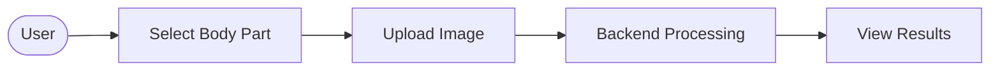

# 4.3 Use Case Diagram

```mermaid
usecaseDiagram
    actor User
    actor SystemAdmin
    
    User --> (Select Body Part Category)
    User --> (Upload Image)
    User --> (View Results)
    
    (Upload Image) .> (Preprocess Image) : include
    (Preprocess Image) .> (Route to Selected Model) : include
    (Route to Selected Model) .> (Predict Deficiency) : include
    
    SystemAdmin --> (Monitor Health Endpoint)
```

**Alternative Flowchart Representation:**

