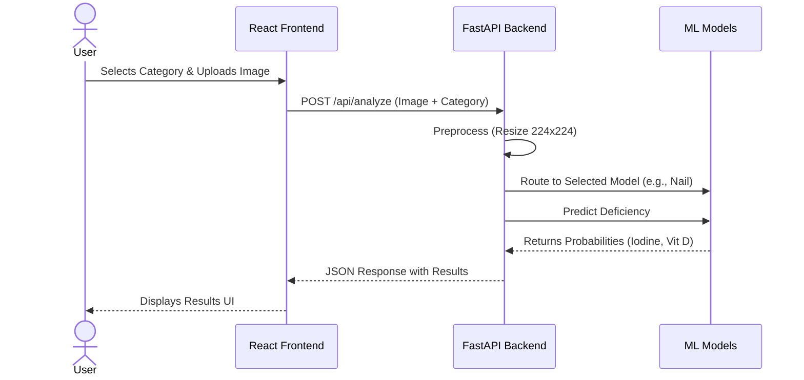

# 4.4 Sequence Diagram

```mermaid
sequenceDiagram
    actor User
    participant Frontend as React Frontend
    participant Backend as FastAPI Backend
    participant ML as ML Models
    
    User->>Frontend: Selects Category & Uploads Image
    Frontend->>Backend: POST /api/analyze (Image + Category)
    Backend->>Backend: Preprocess (Resize 224x224)
    Backend->>ML: Route to Selected Model (e.g., Nail)
    Backend->>ML: Predict Deficiency
    ML-->>Backend: Returns Probabilities (Iodine, Vit D)
    Backend-->>Frontend: JSON Response with Results
    Frontend-->>User: Displays Results UI
```
