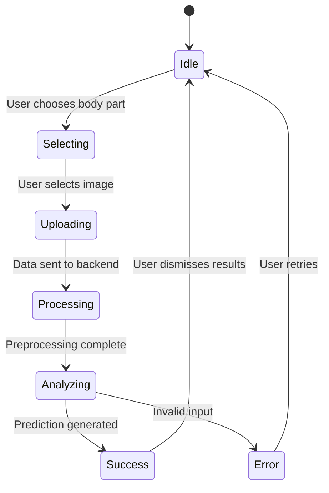

# 4.5 State Chart Diagram

```mermaid
stateDiagram-v2
    [*] --> Idle
    Idle --> Selecting : User chooses body part
    Selecting --> Uploading : User selects image
    Uploading --> Processing : Data sent to backend
    Processing --> Analyzing : Preprocessing complete
    Analyzing --> Success : Prediction generated
    Analyzing --> Error : Invalid input
    Success --> Idle : User dismisses results
    Error --> Idle : User retries
```
