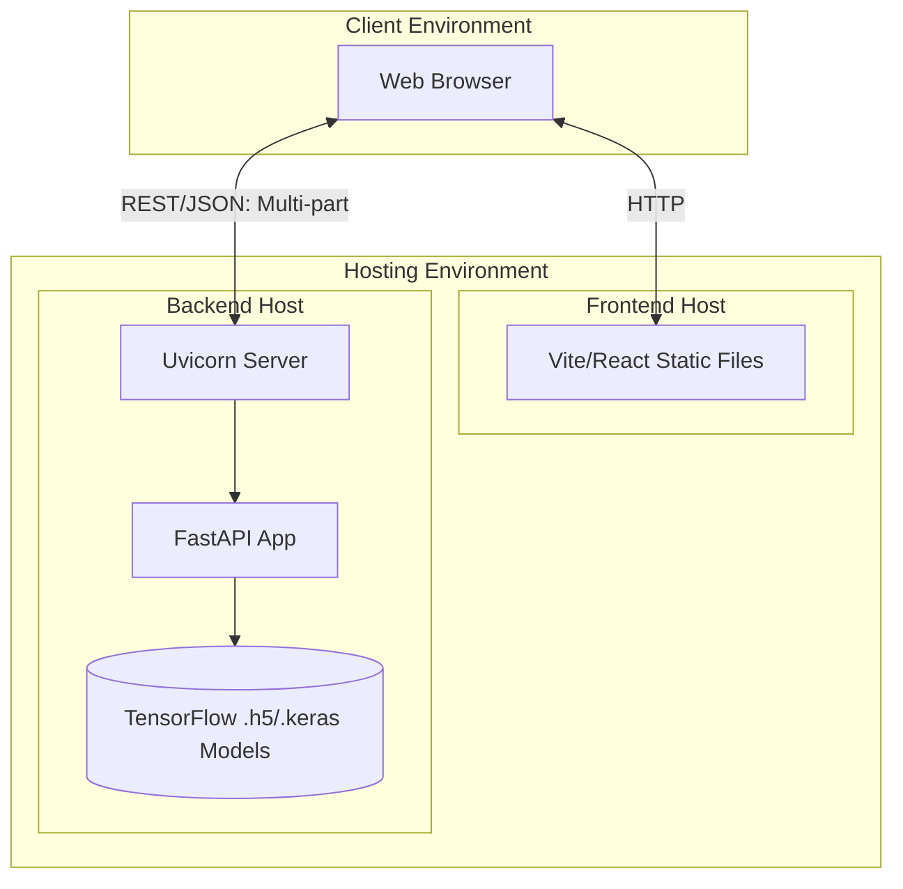

# 4.6 Deployment Diagram

```mermaid
flowchart TD
    subgraph Client [Client Environment]
        Browser[Web Browser]
    end

    subgraph Server [Hosting Environment]
        subgraph FrontendContainer [Frontend Host]
            Vite[Vite/React Static Files]
        end
        subgraph BackendContainer [Backend Host]
            Uvicorn[Uvicorn Server]
            FastAPI[FastAPI App]
            Models[(TensorFlow .h5/.keras Models)]
        end
    end

    Browser <-->|HTTP| Vite
    Browser <-->|REST/JSON: Multi-part| Uvicorn
    Uvicorn --> FastAPI
    FastAPI --> Models
```
